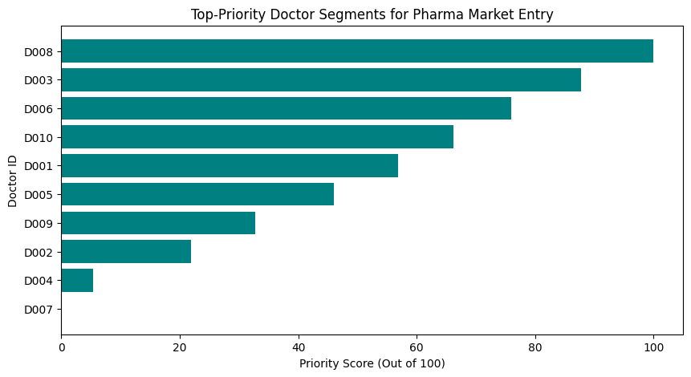

# 📊 Corporate Pharma Market-Entry Analytics Model

## 📌 Project Overview
This data model was independently designed to solve a critical commercial challenge in the healthcare sector: **How to optimize limited marketing resources when launching a novel biotech diabetes drug in the Indian market.** 

Instead of targeting elite, low-volume specialists at tier-1 private hospitals, this model uses data analytics to prioritize high-volume General Practitioners (GPs) to capture maximum market share for a mass-market chronic disease.

---

## 📈 Model Visualization & Performance
Below is the automated priority ranking generated by the data pipeline, allowing sales executives to see high-value targets instantly:



---

## 🧠 Strategic Business Logic (Human Design Architecture)
The underlying algorithm evaluates doctors across three distinct commercial dimensions using a customized **Risk & Revenue Matrix**:

1. **Monthly Patient Volume (32% Weight):** Measures gross foot traffic and overall clinic visibility.
2. **Disease-Specific Count (38% Weight):** Focuses heavily on the core target demographic (verified diabetes cases).
3. **Average Annual Visits (30% Weight):** Tracks patient retention. This is critical for chronic illnesses to ensure patients do not drop off to direct pharmacy refills.

### The Normalization Strategy
To prevent raw patient volume numbers from mathematically overpowering the retention scale (e.g., 1,200 monthly patients vs. 8 annual visits), a **Min-Max Normalization pipeline** was built to scale all parameters proportionally between `0.0` and `1.0` relative to peer performance before applying weights. 

\[Normalized = \frac{Value - Min}{Max - Min}\]

---

## 🛠️ Technical Stack & Workflow
* **Language:** Python 3
* **Libraries:** `pandas` (Data normalization & matrix math), `matplotlib` (Corporate data visualization)
* **License:** MIT Permissive Open-Source

---

## 📝 Sample Executive Output Matrix
The script scales raw medical database matrices, calculates custom priority scores out of 100, and outputs sorted, actionable sales targets for medical representatives:

```text
Rank  Doctor_ID  Monthly_Volume  Diabetes_Count  Avg_Annual_Visits  Priority_Score
   1       D008             530             140                9.2          100.00
   2       D003             480             120                8.5           84.70
   3       D006             410             105                7.9           73.18
   4       D010             360              95                7.1           62.34
```
*(Analytical Takeaway: Doctor D008 emerges as the highest priority asset due to optimal performance across both patient acquisition and long-term diagnostic loyalty).*

---

## 🚀 How to Run the Script
1. Clone this repository or download `market_entry_model.py`.
2. Run the script in any Python environment with pandas and matplotlib installed:
   ```bash
   python market_entry_model.py
   ```
3. The script will output the data table to your terminal and save a fresh version of the chart as `doctor_rankings.png`.
